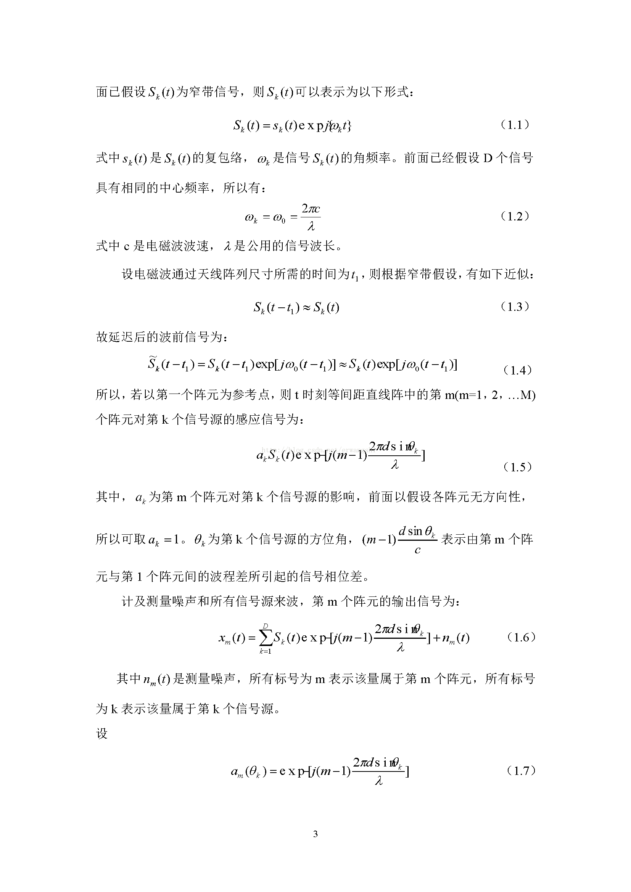
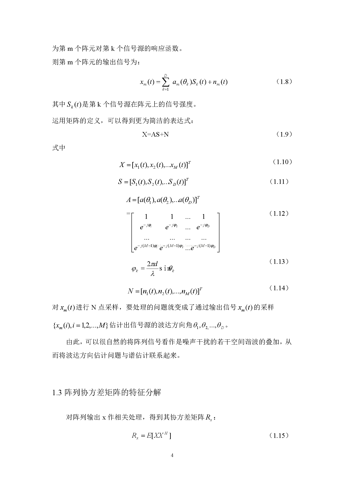

## MUSIC算法讲解

### 1. 算法假设
为了分析推导的方便，现将波达方向估计问题中的数学模型作理想状态的假设如下：
* 各待测信号源具有相同的极化、且互不相关的。一般考虑信号源为窄带的，且各信号源具有相同的中心频率。待测信号源的个数为D
* 天线阵列是由M(M>D)个阵元组成的等间距直线阵，各阵元特性相同，各向同性，阵元间隔为d，并且阵元间隔不大于最高频率信号半波长
* 天线阵列处于各信号源的远场中，即天线阵列接收从各信号源传来的信号为平面波
* 各阵元上有互不相关，与各待测信号也不相关，方差为的零均值高斯白噪声
* 各接收支路具有完全相同的特点

### 2. 阵列形状

### 3. 算法推导

